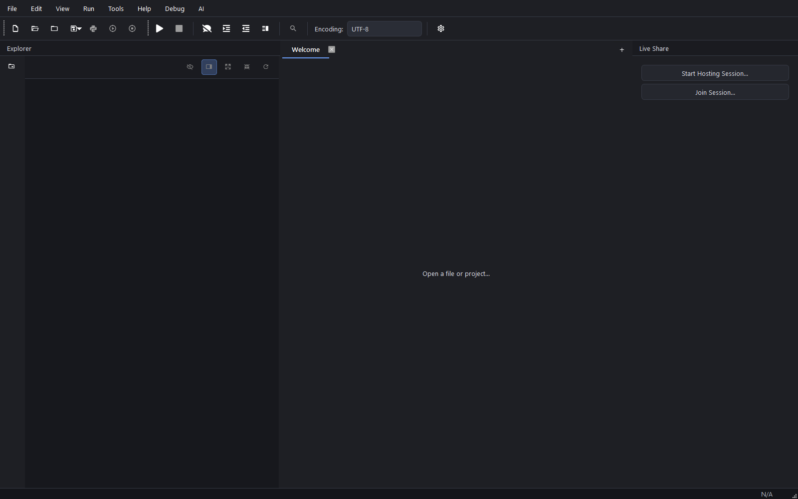
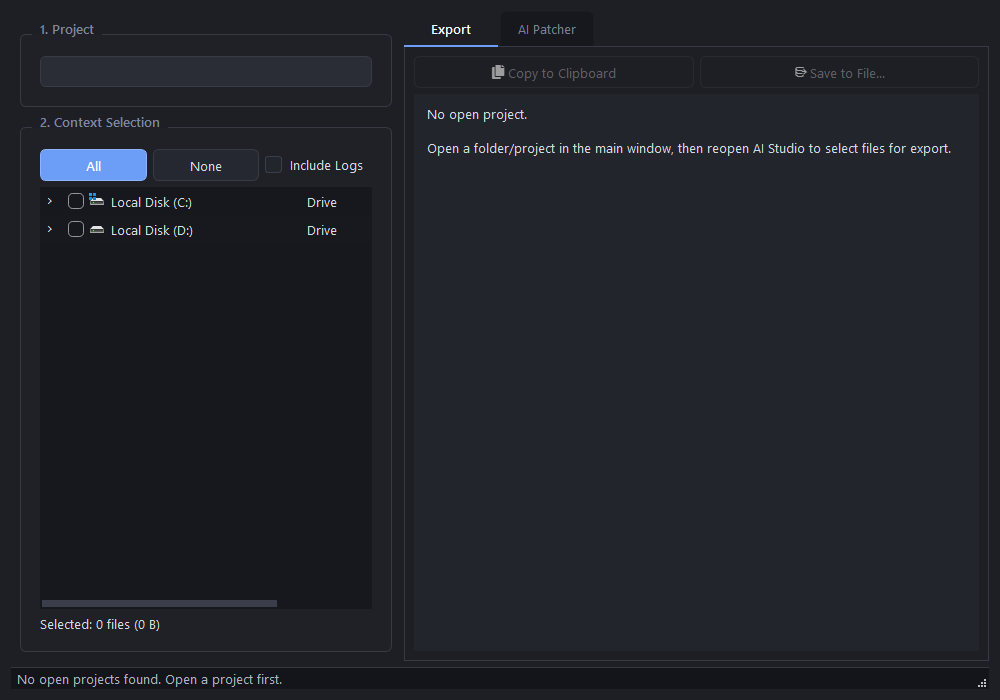

# Koromali

**A lightweight, extensible Python IDE built with PyQt6.**

[](./LICENSE)
[](https://www.python.org/downloads/)
[](https://www.riverbankcomputing.com/software/pyqt/)

Koromali is a native desktop editor for people who want a fast workspace with multi-project browsing, Git, a terminal, plugins, and an **AI Studio** that packages code for browser LLMs and applies writes/patches back into the tree — without the weight of a full enterprise IDE.

**Topics:** `python` · `ide` · `editor` · `pyqt6` · `git` · `plugins` · `ai` · `llm` · `markdown` · `cross-platform` · `noncommercial`

<p align="center">
  
</p>

<p align="center">
  
</p>

---

## Why Koromali?

| | |
|---|---|
| **Python-native** | Editor, plugins, and tooling are all Python + Qt |
| **Lightweight** | Focused feature set; starts without a heavy runtime |
| **AI-friendly** | Export selected files to Markdown; paste model output and apply patches |
| **Extensible** | Drop-in plugins with a small public API |
| **Yours to theme** | Modern dark/light defaults plus many custom palettes |

---

## Features

### Editor
- Theme-aware syntax highlighting (Python, JS/TS, C/C++, C#, HTML/CSS, JSON, Rust, and more)
- Jedi-powered completion and signatures
- Line numbers, find/replace, multi-tab editing, minimap (plugin)

### Projects & files
- Multi-project explorer with drag-and-drop
- Large-file handling when size thresholds are hit

### AI Studio
1. **Tools → AI Studio…**
2. Select context files
3. **Copy** or **Save** Markdown (includes Golden Rules for the model)
4. Paste into a browser LLM
5. Paste the reply into **AI Patcher** → Analyze → Apply

Supports full-file writes, unified diffs, deletes, and moves. Pure-Python patch apply (no system `patch` binary).

<p align="center">
  
</p>

### Tools
- Integrated terminal, Problems panel, Output, Source Control
- Run current file (**F5**) or project launch script (**Shift+F5**)
- Git stage/commit/push and GitHub helpers (clone, releases)

### Customization
- Built-in **Koromali Modern** dark/light themes + Theme Editor
- Preferences for fonts, indentation, auto-save
- Editable Golden Rules for AI output format

---

## Quick start

### Requirements
- **Python 3.10+** (3.12 recommended)
- Windows, macOS, or Linux
- See `requirements.txt` (PyQt6, qtawesome, jedi, GitPython, …)

### From source

```bash
git clone <your-repo-url>
cd Koromali
```

**Windows**

```cmd
run.bat
```

**macOS / Linux**

```bash
chmod +x run.sh
./run.sh
```

First launch creates a local `venv`, installs dependencies, and starts the app. Broken venvs are detected and recreated automatically.

### Manual venv

```bash
python -m venv venv
# Windows: venv\Scripts\activate
# Unix:    source venv/bin/activate
pip install -r requirements.txt
python main.py
```

### Optional environment

| Variable | Purpose |
|----------|---------|
| `KOROMALI_GITHUB_REPO_URL` | Upstream repo URL |
| `KOROMALI_GITHUB_ISSUES_URL` | Issues URL |
| `KOROMALI_GITHUB_PLUGINS_REPO` | Plugins distro (`owner/repo`) |
| `KOROMALI_ORG_NAME` | Org display name |

---

## Project layout

```
Koromali/
├── main.py / bootstrap.py   # App entry
├── app_core/                # Managers, API, highlighters
├── ui/                      # Main window, explorer, widgets
├── plugins/                 # First-party plugins (AI Suite, terminal, …)
├── assets/                  # Themes, personas, branding
├── docs/media/              # Screenshots for docs
├── tests/                   # Unit + UI smoke tests
├── requirements.txt
├── run.bat / run.sh
└── LICENSE                  # PolyForm Noncommercial 1.0.0
```

Local-only (gitignored): `venv/`, `logs/`, `ai_exports/`, settings, credentials, `.koromali/`.

---

## Plugins

Each plugin is a folder under `plugins/` with `plugin.json` + entry module:

```json
{
  "id": "example",
  "name": "Example Plugin",
  "author": "Koromali Team",
  "version": "1.0.0",
  "description": "Short description.",
  "entry_point": "plugin_main.py"
}
```

```python
def initialize(koromali_api):
    return MyPlugin(koromali_api)
```

**Security:** plugins run with full app permissions. Only load code you trust.

---

## Development & tests

```bash
export PYTHONPATH=.          # Windows: set PYTHONPATH=.
export PYTEST_DISABLE_PLUGIN_AUTOLOAD=1
pytest tests/ -q
```

UI smoke (Windows Qt, writes screenshots to `tests/_smoke_artifacts/`):

```bash
set QT_QPA_PLATFORM=windows
pytest tests/test_ui_smoke.py -v -s
```

---

## Privacy

Settings, tokens, and API keys live in the **application data** directory, not the project tree:

| OS | Path |
|----|------|
| Windows | `%LOCALAPPDATA%\Koromali\Koromali` |
| Linux | `~/.local/share/Koromali/Koromali` |
| macOS | `~/Library/Application Support/Koromali/Koromali` |

Do not commit `credentials.json` or `Koromali_editor_settings.json`.

---

## License

**[PolyForm Noncommercial License 1.0.0](./LICENSE)** — free for personal, educational, research, hobby, and non-profit use. **Not for commercial use** without a separate commercial license.

See [`LICENSE.md`](./LICENSE.md) for a short summary and [`LICENSE`](./LICENSE) for the full text.

Required Notice: Copyright Koromali contributors.

---

## Contributing

Bug reports and focused PRs are welcome. Prefer small changes with a note of what you verified (tests or manual smoke).

Suggested GitHub topics and About blurb: [`docs/TOPICS.md`](./docs/TOPICS.md).

---

## Version

See [`VERSION.txt`](./VERSION.txt).
